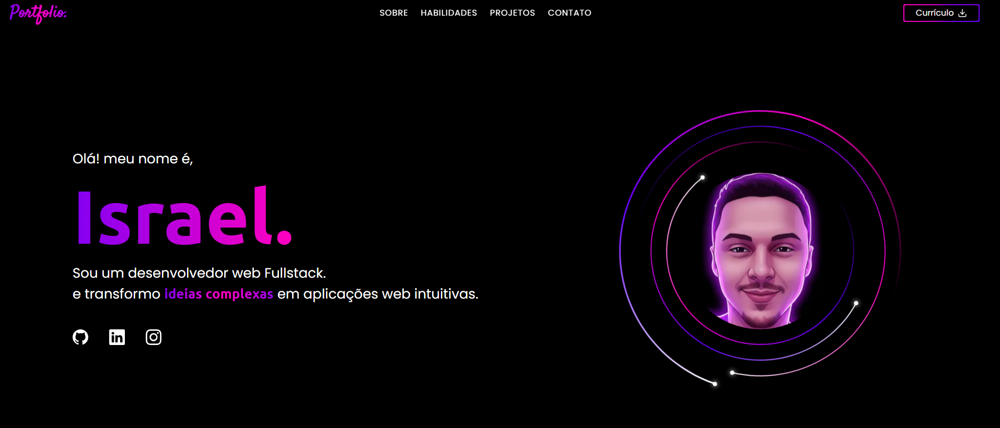

  

<h1 align="center">
  Portfólio Pessoal | Israel Miguel
</h1>

  Bem-vindo ao repositório do meu portfólio pessoal!
   
  Um projeto construído com Astro, Preact, Tailwind CSS e GSAP para criar uma experiência de usuário moderna, rápida e interativa.

  

 

<h2 align="center">📚 Tecnologias Utilizadas</h2>

  &emsp;
  &emsp;
  &emsp;
  &emsp;
  &emsp;

 

## 🌟 Recursos Principais

* **Performance Otimizada:** Construído com Astro para carregamento ultra-rárpido (zero JS por padrão).
* **Design Responsivo:** Adaptado perfeitamente para todos os tamanhos de tela com Tailwind CSS.
* **Animações Interativas:** Impulsionado pela biblioteca GSAP para transições suaves e envolventes.
* **Componentização:** Uso de componentes dinâmicos e reutilizáveis (Preact) para modularidade.

## 🛠️ Como Rodar o Projeto Localmente

  
<strong>Clique para ver os passos de instalação</strong>

   
  
  
Siga estes passos para rodar o projeto na sua máquina:

  
  <ol>
    <li>
      <strong>Clone o repositório:</strong>
      <pre><code>git clone https://github.com/Miguel-MirageScript/Meu-Portifolio.git</code></pre>
    </li>
    <li>
      <strong>Navegue até o diretório:</strong>
      <pre><code>cd Meu-Portifolio</code></pre>
    </li>
    <li>
      <strong>Instale as dependências:</strong>
      <pre><code>npm install</code></pre>
    </li>
    <li>
      <strong>Inicie o servidor de desenvolvimento:</strong>
      <pre><code>npm run dev</code></pre>
    </li>
  </ol>
  
  
O servidor local estará disponível em <code>http://localhost:4321</code> (porta padrão do Astro).

 

## 📄 Licença

Este projeto é licenciado sob a **Licença MIT**.

> Você pode usar, copiar, modificar e distribuir este projeto para qualquer finalidade, contanto que:
> * Inclua o aviso de direitos autorais original.
> * Mantenha a Licença MIT em todas as cópias ou porções substanciais do software.
> * O crédito visível seja dado a Israel Miguel (por exemplo, no README, rodapé ou documentação).
